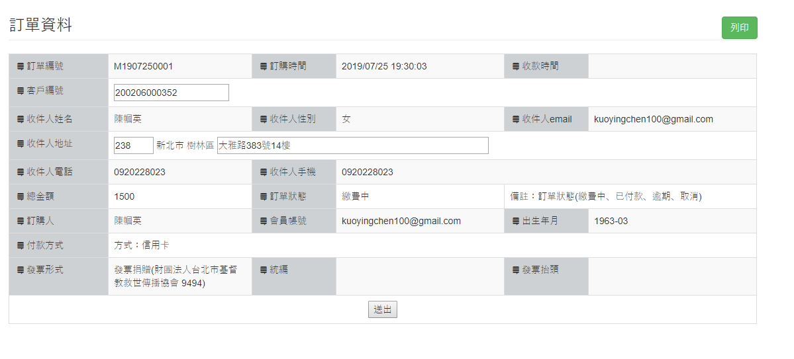

# Studio Classroom Interview Project (Front-end Developer)

空中英語教室 前端工程師面試試題


## Instruction

- There are 3 parts of the quiz, please answer it by part.
- Please finish the quiz within 72hrs after receiving the email and reply the answer through the email attachment file.
- You can only use Vue.js to answer Part1.(Reference: https://vuejs.org)

### PART(1)

Please use the provided files to create a web application according to the following specifications:**(Using Vue.js only)**

1. When browser initially loads `index.html` ,both User Info and User List show no data.

2. Pressing [Fetch] button will send HTTP request to https://jsonplaceholder.typicode.com/users for data. Then use the field styles of the User List table, show all data sort by "id" desc.
 
3. Pressing [Parse] button will convert all data to lowercase letters and link all emails. Open a system default mail service in a new tab when pressing a email link.

4. Pressing [Detail] button for each item will display the user information in the User Info list. If "Phone" starts with '1', use red font to highlight it.

5. Pressing [Delete] button for each item will delete the item in the table.

6. Add a sort feature: When you click on the header of each column, table starts to display a special control indicating which column the table is currently sorted by and the direction of this sorting (ascending or descending). Each next click on the same header will reverse the sorting direction.
 
7. Add a search input: searching whole User List table and filering in the table.


### PART(2) 

Please create a form template like the picture below.

You can change any Chinese text in labels/fields into English(ex. email, phone, address... use your imagination)

*extar points: Try to make the form prettier by using css/bootstrap/js.




### PART(3) Extar points (It's good, not necessary)
Q1: According to `php_sql.php` example, use PHP/SQL to code create/delete/update functions.

Q2: According to `php_json.php` example, use PHP to print the json.

Q3: Please explain the following Cron command?

```
[user]$ crontab -l
0 2 * * * php /var/www/html/mshop/releaseSession.php
```

### Remark

- You can use any library or framework(Part2, Part3) to do it.
- You can search any document while doing it. But do not discuss with others.